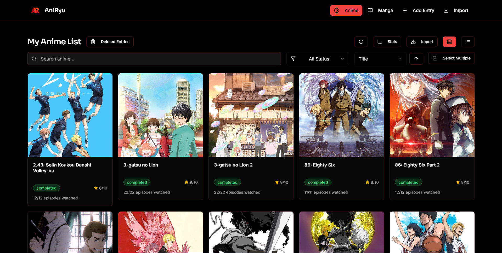
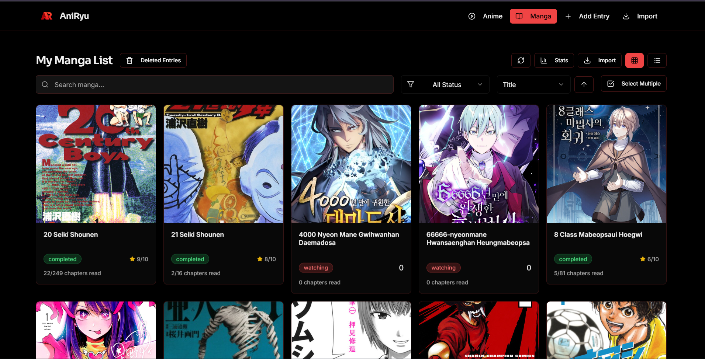
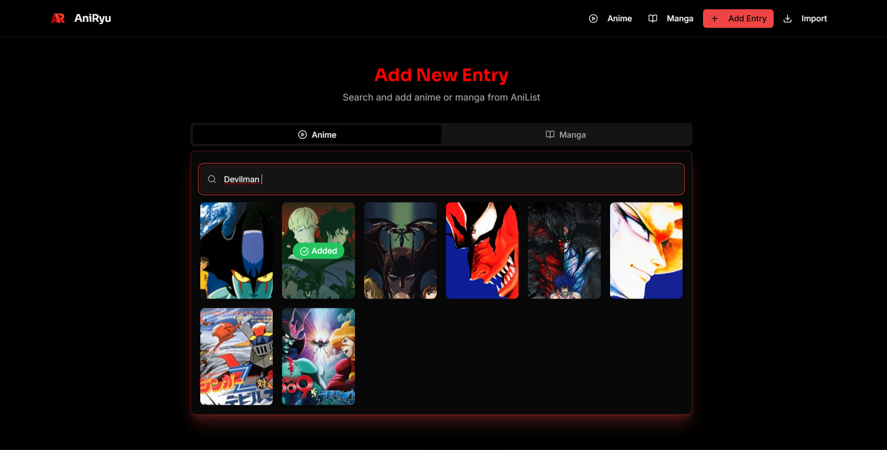
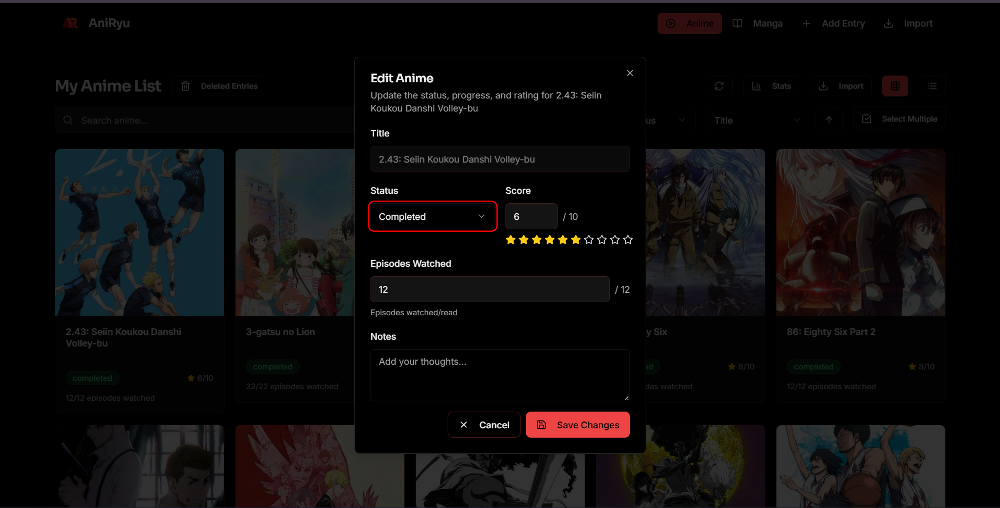
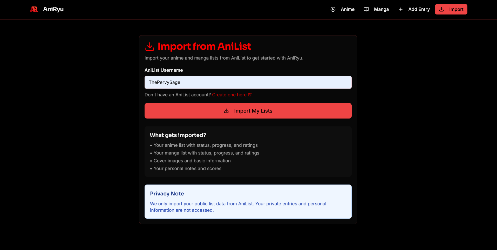
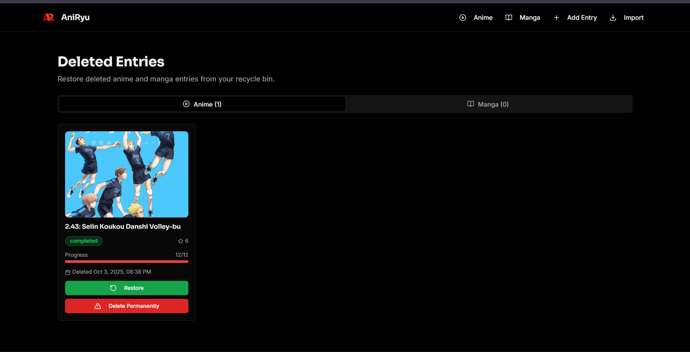

# AniRyu - Anime & Manga List Tracker

A modern, full-stack application for tracking your anime and manga collection with beautiful statistics and bulk management features.

<div align="center">
  
  <p><em>Beautiful, modern interface for managing your anime and manga collection</em></p>
</div>

## 🚀 Quick Start

### Prerequisites
- **Node.js** (v18 or higher) - [Download here](https://nodejs.org/)
- **Go** (v1.19 or higher) - [Download here](https://golang.org/dl/)
- **pnpm** (recommended) or npm

### Easy Setup (Windows)
1. **Clone the repository**
   ```bash
   git clone https://github.com/KronosWasTaken/AniRyu.git
   cd AniRyu
   ```

2. **Install dependencies**
   ```bash
   pnpm install
   ```
   
   **Note**: If you encounter esbuild errors, run:
   ```bash
   pnpm config set enable-pre-post-scripts true
   pnpm add -D esbuild
   ```

3. **Run the application**
   ```bash
   # Double-click start.bat or run:
   start.bat
   ```

That's it! The application will start both the backend and frontend servers automatically.

### Docker Setup (Recommended)
The easiest way to run AniRyu is using Docker. This handles all dependencies (Node, Go, etc.) for you in a single command.

1. **Install Docker Desktop** from [docker.com](https://www.docker.com/)
2. **Run the application**:
   ```powershell
   docker compose up --build
   ```
3. **Access the app** at http://localhost:8080

**Note**: Your data is automatically saved in the `./data` folder and will persist even if you stop or rebuild the container.

### Manual Setup
If you prefer to run servers separately:

```bash
# Terminal 1 - Backend
cd backend
go run cmd/server/main.go

# Terminal 2 - Frontend  
pnpm run dev
```

## 🌐 Access Points
- **Frontend**: http://localhost:5173 (or http://localhost:8080 if using Docker)
- **Backend API**: http://localhost:3001
- **Import Page**: http://localhost:5173/import (or http://localhost:8080/import if using Docker)

## ✨ Features
- 📺 **Anime & Manga Tracking** - Add, edit, and manage your collection
- 📊 **Beautiful Statistics** - Comprehensive analytics and progress tracking
- 🔄 **Bulk Operations** - Select multiple items for batch updates
- 🎨 **Modern UI** - Dark theme with smooth animations
- 📱 **Responsive Design** - Works perfectly on all devices
- 🔍 **Advanced Search** - Find anime/manga with powerful filtering
- 📈 **Progress Tracking** - Monitor your watch/read progress
- ⭐ **Rating System** - Rate your favorite shows and books

## 📸 Screenshots

### Main Interface

*Clean and modern anime list interface with beautiful cards*


*Organized manga collection with progress tracking*

### Key Features

*Easy-to-use form for adding new anime or manga*


*Comprehensive editing interface with all details*


*Seamless import from AniList with progress tracking*


*Manage deleted entries with restore functionality*

## 🛠️ Tech Stack

### Frontend
- **React 19** - Cutting-edge UI library
- **TypeScript 6** - Strict type-safe development
- **Vite 8** - Ultra-fast build tool with Rolldown & Oxc
- **Tailwind CSS v4** - Modern CSS-first utility framework
- **shadcn/ui** - Beautiful component library
- **Framer Motion** - Smooth animations
- **React Router 7** - Modern client-side routing

### Backend
- **Go** - High-performance server
- **Gin** - HTTP web framework
- **GORM** - ORM for database operations
- **SQLite** - Lightweight database

### Development Tools
- **ESLint** - Code linting
- **PostCSS** - CSS processing

## 📁 Project Structure
```
AniRyu/
├── backend/                 # Go backend server
│   ├── cmd/server/         # Main server entry point
│   ├── internal/           # Internal packages
│   │   ├── handlers/       # HTTP handlers
│   │   ├── services/       # Business logic
│   │   ├── repositories/  # Data access layer
│   │   └── models/         # Data models
│   └── data/              # Database files (ignored by git)
├── src/                    # React frontend
│   ├── components/         # Reusable components
│   ├── pages/             # Page components
│   ├── hooks/             # Custom React hooks
│   ├── services/          # API services
│   └── types/             # TypeScript definitions
├── public/                 # Static assets
└── start.bat              # Windows startup script
```

## 🔧 Development

### Available Scripts
```bash
# Frontend
pnpm run dev          # Start development server
pnpm run build        # Build for production
pnpm run preview       # Preview production build

# Backend
go run cmd/server/main.go    # Start Go server

### Development Container
This project includes a **Dev Container** configuration for VS Code. To use it:
1. Open this folder in VS Code.
2. Click the blue button in the bottom-left corner and select **"Reopen in Container"**.
3. All tools (Node 24, Go 1.21, pnpm) will be automatically configured for you.
```

## 🚀 Deployment
1. Build the frontend: `pnpm run build`
2. Deploy the backend Go server
3. Serve the built frontend files

## 📝 License
This project is for personal use. Please respect AniList's API terms of service.
